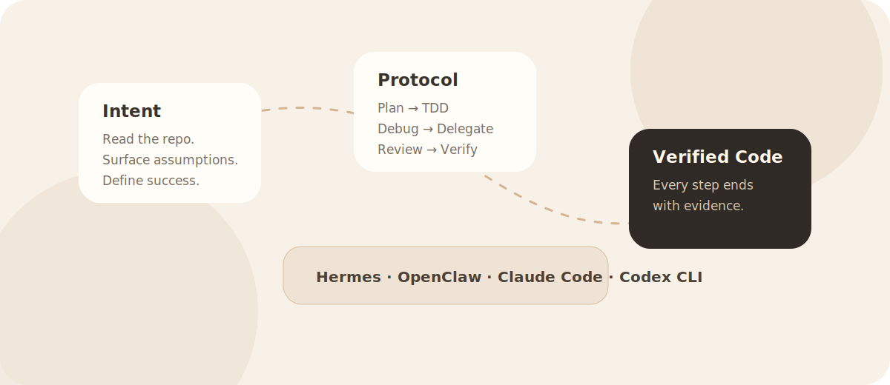
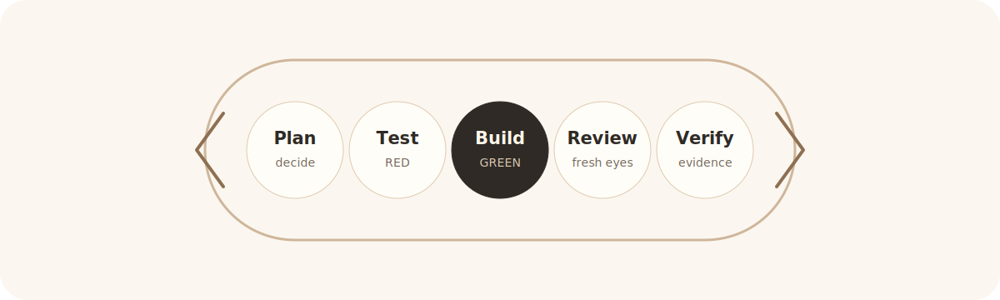
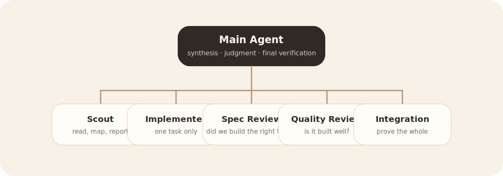

# AgentForge Protocol

<p align="center">
  <strong>给编程 Agent 用的协议。重点不是写得快，是写完有证据。</strong>
</p>

<p align="center">
  <em>适用于 Hermes、OpenClaw、Claude Code、Codex CLI，以及任何能读文件、改代码、跑测试、派 subagent、检查自己说法的 Agent。</em>
</p>

<p align="center">
  <a href="https://github.com/Yat-mo/agentforge-protocol"></a>
  
  
</p>

<p align="center">
  <a href="README.md">English</a> ·
  <a href="README.zh-CN.md">简体中文</a> ·
  <a href="README.zh-TW.md">繁體中文</a>
</p>

<p align="center">
  
</p>

> 编程 Agent 很快。这是好玩的地方，也是危险的地方。AgentForge Protocol 保留速度，但要求每一步都留下证据。

---

## 为什么需要它

它们可以在还没理解仓库前就写出 patch。可以生成一份看起来很整齐、但其实什么也证明不了的计划。可以开几个 subagent，收下它们的汇报，然后悄悄把一坨东西 ship 出去。

真正用这些工具干过活的人，大概都见过某个版本的这种场面。

AgentForge Protocol 是一套很小的操作习惯，用来避开这种坑。它告诉 Agent 什么时候保持轻量，什么时候该慢下来，什么时候先写测试，什么时候应该 debug 而不是猜，什么时候可以派 subagent，但不能把方向盘交出去。

**核心很简单：有意义的步骤，最后都要留下证据。**

这个版本也吸收了架构驱动治理里有用的部分：先读 baseline，再判断影响面；把修复轨和退役轨分开；长任务保留 checkpoint，避免中途跑偏。

---

## 一眼看懂

| 如果任务是... | 协议会这样处理 |
| --- | --- |
| 很小、很明显 | inspect，patch，跑最便宜的有效检查，然后停 |
| 清晰的行为改动 | 先写失败测试，再让它通过 |
| 模糊或架构类 | 先 inspect，再追问关键决定，最后保存计划 |
| 多步骤任务 | 拆任务，用聚焦 subagent，分阶段 review |
| bug 或测试失败 | 复现，追根因，加 regression test |
| 不确定能不能做 | 先 spike，不要直接写进 production architecture |

<p align="center">
  
</p>

---

## 它组合了什么

`agentforge-protocol` 站在几个更小的 skill 之上，决定当前该由谁主导。

| Skill | 负责什么 |
| --- | --- |
| `karpathy-guidelines` | 小 diff，少假设，少耍聪明 |
| `grill-plan` | 需求模糊或风险高时，先做决定再写代码 |
| `writing-plans` | 把清晰需求变成 Agent 真能执行的步骤 |
| `test-driven-development` | 行为改动先有失败测试，再有修复 |
| `systematic-debugging` | patch 前先找根因 |
| `subagent-driven-development` | 拆任务，但不丢掉控制权 |
| `requesting-code-review` | commit、push、ship 前的最后一道门 |
| `spike` | 不确定时先做能丢的实验 |

它用 Hermes 自己的层级，不额外制造文档垃圾：

- 当前进度进 `todo` tool
- 非琐碎计划进 `.hermes/plans/`
- 稳定的用户偏好或环境事实进 memory
- 可重复的流程和坑点变成 skill
- 只有仓库本来就这么做时，才使用项目里的 `tasks/lessons.md`

---

## 安装

```bash
git clone https://github.com/Yat-mo/agentforge-protocol.git
mkdir -p ~/.hermes/skills/software-development
cp -R agentforge-protocol/skills/software-development/agentforge-protocol \
  ~/.hermes/skills/software-development/
```

启动新的 Hermes session，让 skill loader 读到它：

```bash
hermes --skills agentforge-protocol
```

或在 Hermes 里加载：

```text
/skill agentforge-protocol
```

---

## 快速开始

```text
Use agentforge-protocol. Add email validation to the signup flow.
```

```text
Use agentforge-protocol. Design and implement workspace-level permissions.
```

```text
Use agentforge-protocol. The export job passes locally but fails in CI with a timezone assertion.
```

```text
Use agentforge-protocol. Spike whether we can stream partial PDF extraction results to the UI.
```

---

## 路由器

第一步是判断任务类型。错字不需要仪式感，迁移就需要。

<details open>
<summary><strong>琐碎且明显的改动</strong></summary>

轻处理。

```text
inspect → minimal patch → cheap verification → stop
```

不强行写计划。不强行派 subagent。不演流程。

</details>

<details open>
<summary><strong>清晰的行为改动</strong></summary>

默认走 TDD，除非真的有理由不走。

```text
read existing pattern
→ define baseline / hypothesis / success / failure / evidence plan
→ 必要时追踪修复轨 + 退役轨
→ write failing test
→ run RED
→ implement minimal code
→ run GREEN
→ run relevant regression
```

</details>

<details open>
<summary><strong>模糊或架构类任务</strong></summary>

碰 production code 前，先用 grill-plan。

```text
inspect code/docs/tests/logs
→ ask only what cannot be inspected
→ resolve decisions one by one
→ save `.hermes/plans/...md`
→ review plan
→ implement from the plan
```

</details>

<details open>
<summary><strong>多任务实现</strong></summary>

可以用 subagent，但主 Agent 仍然负责结果。

```text
read saved plan once
→ extract tasks
→ implementer subagent per task
→ spec compliance review
→ code quality review
→ integration review
→ final verification
→ pre-commit gate
```

</details>

<details open>
<summary><strong>Bug 或测试失败</strong></summary>

先 debug，再 patch。

```text
read full error
→ reproduce
→ inspect recent changes
→ trace data flow
→ form one hypothesis
→ write regression test
→ fix root cause
→ verify
```

</details>

<details open>
<summary><strong>可行性未知</strong></summary>

先 spike。不要把不确定性直接写进 production architecture。

```text
decompose feasibility questions
→ test highest risk first
→ build disposable prototype
→ record VALIDATED / PARTIAL / INVALIDATED
→ only then plan production work
```

</details>

---

## 编码前预期

非琐碎 production code 动手前，先写下这些东西：

```md
## Pre-coding expectations

### Baseline read set
动手前要读的 source of truth、架构边界、owner、影响面、兼容约束和验证入口。

### Hypothesis
我认为系统里什么是真的，以及为什么这个改动应该有效。

### Success criteria
哪些检查能让我放心说，这事做完了。

### Failure signals
说明方案错了或不安全的独立信号。
不能只是“成功标准没通过”。

### Ablations and expected observations
如果换掉某个关键假设或做法，我预期会看到什么。

### Evidence plan
最终结论需要哪些 fresh evidence 支撑：测试、命令、日志、API 响应、截图或 diff review。

### Minimal verification path
最便宜的证明方式：测试、命令、API 调用、UI 操作或日志检查。
```

这段不是装严谨。它是用来防止 Agent 凭感觉写代码的。

---

## 计划形态

非琐碎计划放在 `.hermes/plans/`，每一步都写成 action → verification。

```md
# <Task> Implementation Plan

## Goal

## Non-goals

## Context discovered from code/docs/logs

## Pre-coding expectations

### Baseline read set
### Hypothesis
### Success criteria
### Failure signals
### Ablations and expected observations
### Evidence plan
### Minimal verification path

## Confirmed decisions

## Rejected alternatives

## Fix lane and retirement lane

## Checkpoint, resume hint, and drift check

## Implementation steps

1. <Action> -> verify: <check>
2. <Action> -> verify: <check>
3. <Action> -> verify: <check>

## Files likely to change

## Tests and validation

## Risks and rollback

## Review notes
```

“让它工作”不是计划。每一步都要知道怎么证明自己。

---

## Subagent 规则

Subagent 很有用，也很会说得像真的。

<p align="center">
  
</p>

| 规则 | 为什么重要 |
| --- | --- |
| 一个 subagent 只拿一个聚焦任务 | 宽泛 prompt 会产出宽泛结果 |
| 给清楚路径、命令、约束和预期输出 | fresh context 需要真实上下文 |
| implementer subagent 不 commit | 最终状态由主 Agent 负责 |
| spec review 先于 code quality review | 先确认有没有做对事 |
| 主 Agent 亲自验证副作用 | 自述不是证据 |

常见 subagent 角色：repository scout、implementation worker、spec compliance reviewer、code quality reviewer、debugging investigator、integration reviewer。

---

## 完成门禁

Agent 说“完成”之前，先检查这些无聊但要命的事：

- 测试或 smoke check 真的跑过
- 如果测试跑不了，原因说清楚
- diff 小，而且能对应到用户请求
- 没有无关重构或格式漂移
- 没留下自己造成的 orphan imports、文件、配置或 TODO
- fresh evidence 要明确写出来，不能暗示
- 日志、API 响应、UI 行为或测试输出能支撑结论
- bug fix、重构、contract 调整要解决修复轨和退役轨，或说明剩余风险
- 长任务或高风险任务要有 checkpoint、resume hint 和 drift check
- 高风险改动经过独立 review
- 可复用经验放到了正确地方

commit、push、ship 或 PR 前：

```text
targeted tests
→ broader tests where reasonable
→ git diff / git status
→ secret and local-data scan
→ independent review when risk is meaningful
→ commit only after verification passes
```

---

## Skill 布局

```text
skills/
└── software-development/
    └── agentforge-protocol/
        └── SKILL.md
```

这个仓库刻意保持很小。它发布的是一个 workflow skill，不是一个框架。

---

## Philosophy

好的 agentic coding 不是让模型变慢。

而是让模型更难被骗。

更难被模糊需求骗。更难被没什么证明力的 passing tests 骗。更难被看似合理的 subagent 汇报骗。更难被遮住症状的补丁骗。更难被看起来很努力的大 diff 骗。

小事足够小时就保持小。事情可能伤到你时，就系统化处理。

---

## License

MIT
